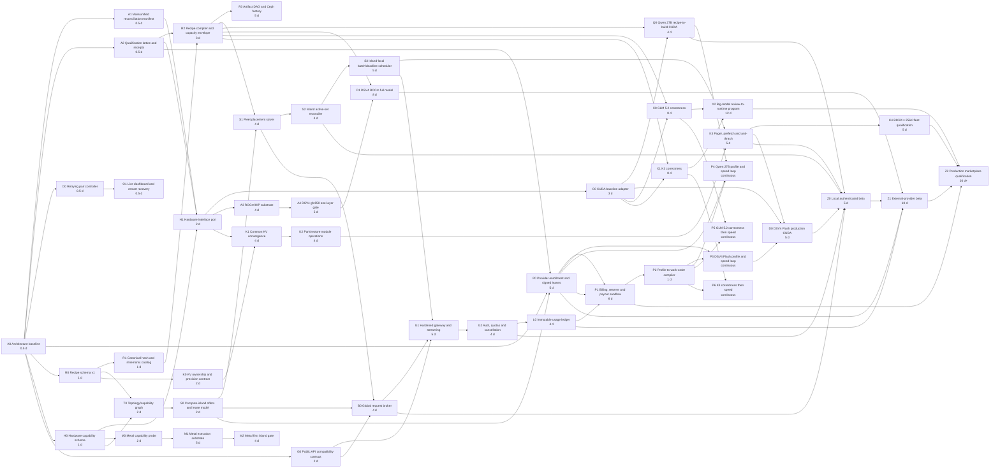

# SparkPipe platform PERT and delivery graph

The graph is dependency-driven. Durations are engineering estimates, not
deadlines or performance claims. Parallel work begins only when its input
contract is frozen and its write set is independent.

## Critical paths

### Local product path

`A0 -> R0 -> R1 -> R2 -> Q0 -> Z0`

This yields one recipe-selected, authenticated local service while the broader
model/backend matrix continues in parallel.

### Performance lead path

`A0 -> P0 -> P1 -> P2 -> per-model profile -> audited optimization -> live receipt`

This path runs continuously. A SOTA observation expires when its daily source
scan or comparability fields are stale. Working models enter the profile and
optimization loop immediately; non-working models remain on correctness gates
before performance work can claim progress.

### Hardware-neutral path

`A0 -> H0 -> H1 -> A3 -> A4 -> D1 -> Z1`

This is blocked by actual MI350P access at hardware gates, not by host-only
scaffolding.

### KV scale path

`A0 -> R0 -> K0 -> K1 -> K2 -> K3 -> K4 -> Z2`

B1024 and 256K are an offered-load and parked-session goal. A single device is
not expected to hold every lane active simultaneously.

### Marketplace path

`A0 -> H0 -> T0 -> S0 -> P0 -> Z1 -> Z2`, with request routing through
`G0 -> B0 -> G1` and the independent financial path
`G0 -> G1 -> G2 -> L0 -> P1 -> Z2`.

## First 24-hour cut

The first day targets contract and controller milestones, not the final graph:

| Lane | Deliverable | Exit evidence |
| --- | --- | --- |
| Architecture | A0, A1, A2 drafts | Reviewed docs, machine-readable reconciliation and task graph |
| Agent control | O0, O1 | One implementation/audit pair survives injected 429, empty response, process restart, and audit rejection |
| Performance | P0, P1, first P3 refresh | Daily primary-source ledger, field-level comparability decisions, 110% targets, and a no-drop DSV4 work-order queue |
| Recipes | R0 and R1 skeletons | Schema positives/negatives, canonical hash vectors, mnemonic collision tests |
| Hardware | H0 and H1 reviewable slices | Host compile, no vendor types in portable headers, preserved CUDA contract tests |
| Topology/scheduler | T0, S0, and B0 contracts | Island offer filtering, locality groups, lease expiry, no-double-sell, and global-to-local admission tests |
| KV | K0 contract and K2 ABI design | Capacity arithmetic, 1/N ownership assertions, no-mid-decode-paging tests |
| API | G0 contract tests and G1 skeleton | Standard payload/error/SSE fixtures; existing `model_api.c` remains private |
| Backends | A3 and M0 compile/probe scaffolds | Honest host/simulator receipts only; no device-readiness claim |

## Pairing rules for the DAG

- Every box in the graph expands to one or more task contracts.
- Each task has an implementer and an independent auditor.
- The auditor waits for an immutable patch hash, then starts in a fresh clone.
- A rejected patch returns to the same task with a new attempt; dependents stay
  blocked.
- Overlapping write sets create an additional scheduler lock even when the PERT
  graph has no semantic edge.
- Hardware tasks may complete host-only subtasks while their target gate stays
  blocked. Their state must say which gate is missing.

## Realistic program size

The complete graph is a multi-week engineering program even with substantial
parallelism because target-hardware, integration, correctness, load, security,
and zero-drift release gates are serial at key boundaries. Dozens of agents can
compress independent implementation and audit work; they cannot make a failed
numerical or hardware gate true by consensus.
